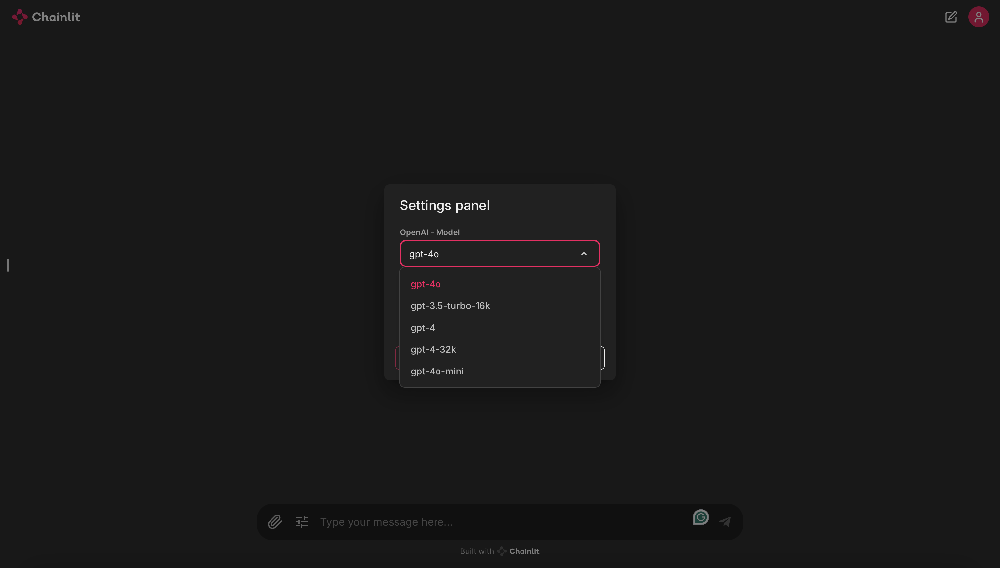
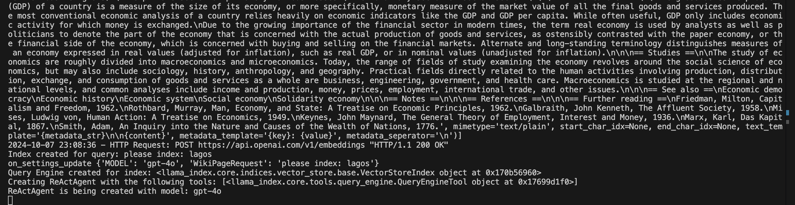

# Wikipedia-Enhanced Conversational AI

## Overview

This project is an AI-powered chatbot designed to retrieve and provide accurate information from Wikipedia using **LlamaIndex**, **Chainlit**, and **OpenAI GPT models**. By leveraging **Retrieval-Augmented Generation (RAG)**, the chatbot can answer user queries based on real-time content retrieval from Wikipedia, making it more contextually aware and accurate in its responses.

## Features

- **Wikipedia Indexing:** Index Wikipedia pages and create a searchable knowledge base.
- **Retrieval-Augmented Generation (RAG):** Combines retrieval of documents from Wikipedia with OpenAI's GPT models for enhanced accuracy.
- **Natural Language Responses:** Powered by OpenAI's GPT models to generate human-like and context-aware responses.
- **Custom Search Engine:** A specialized search engine that retrieves relevant sections from indexed Wikipedia pages.
- **Chat Memory Buffer:** Maintains context throughout the conversation, improving user experience by remembering previous interactions.

## Tech Stack

- **LlamaIndex**: For indexing and querying Wikipedia pages.
- **Chainlit**: Used to build a conversational user interface for the chatbot.
- **OpenAI GPT Models**: For natural language understanding and response generation.
- **Python**: Backend development.
- **Pydantic**: For handling structured data and validation in the application.

## Getting Started

### Prerequisites

- **Python 3.8+**: Ensure you have Python installed.
- **OpenAI API Key**: You will need your own OpenAI API key to run this project.

## Installation

1. Clone the repository:
   ```bash
   git clone `https://github.com/temilola23/wikipedia-chatbot.git`
   ```

2. Navigate to the project directory:
  ```bash
  cd wikipedia-chatbot
  ```

3. Create a virtual environment (optional but recommended):
  ```bash
  python3 -m venv .venv
  source .venv/bin/activate
  ```

4. Install the required dependencies:
  ```bash
  pip install -r requirements.txt
  ```


### Setting Up API Keys

To use this project, you'll need an OpenAI API key. Create an apikeys.yml file in the project directory and add your key in the following format:

```yaml
openai:
  api_key: "your_openai_api_key_here"
```

Make sure `apikeys.yml` is added to your `.gitignore` to avoid exposing your API key when sharing the repository.


## How to Run

1. Start the Chainlit server:
```bash
  chainlit run chat_agent.py
```

2. Open your browser and go to `http://localhost:8000` to interact with the chatbot.

3. When the chatbot comes up:
  * Go to settings
  * select the model you desire:
    
  * Ask the chatbot to begin indexing a wikipedia page, following the format: `please index: {page you want to index}`:
    
  * Your terminal shows the progess of indexing:
    
  * You should receive a message saying the page indexing was a success in Chainlit UI:
    
  * You can go ahead and query the chatbot afterwards


## Project Structure

The project is organized as follows:
``` plaintext
  ├── chainlit/                     # Contains Chainlit-specific configurations
  │   ├── translations/             # Holds translation files for localization
  │   └── config.toml               # Chainlit configuration file
  ├── .gitignore                    # Specifies files and directories to ignore in version control
  ├── apikeys.yml                   # Holds the OpenAI API key (not included in version control)
  ├── chat_agent.py                 # The main chatbot logic and conversation handling script
  ├── index_wikipages.py            # Handles Wikipedia page indexing and knowledge base creation
  ├── LICENSE                       # Contains the license of the project
  ├── README.md                     # Documentation of the project
  ├── requirements.txt              # Python dependencies
  ├── utils.py                      # Utility functions, such as loading API keys
```


## Explanation of Key Components

### chat_agent.py

This file contains the main logic for the conversational AI using Chainlit. It uses OpenAI models, Wikipedia indexing, and retrieval functions to generate responses.
* Chat Start: Sets up initial parameters, including OpenAI models and user query input.
* Query Engine: Uses LlamaIndex to create a search engine for querying indexed Wikipedia pages.
* ReAct Agent: Implements the ReAct agent from LlamaIndex, enabling intelligent decision-making based on retrieved Wikipedia content.

### index_wikipages.py

This file handles retrieving and indexing Wikipedia pages using LlamaIndex and the OpenAI API. It creates a searchable vector store from the indexed documents.
* Wikipedia Reader: Fetches Wikipedia content based on user input.
* Document Splitting: Splits long documents into manageable chunks for indexing and searching.
* Index Creation: Builds a VectorStoreIndex that allows querying of the indexed Wikipedia pages.

### utils.py

Utility script for loading the OpenAI API key from the `apikeys.yml` configuration file.

### requirements.txt

Specifies the Python dependencies needed for the project. These include:
* chainlit: For building the conversational interface.
* llama_index: For document indexing and search.
* openai: For utilizing OpenAI's GPT models.
* pydantic: For data validation.


## License
This project is licensed under the MIT License. See the [LICENSE] (./LICENSE) file for details.


## Acknowledgments

* LlamaIndex: For the indexing and retrieval functionality.
* Chainlit: For providing a simple way to build conversational UIs.
* OpenAI: For powering the natural language understanding and response generation.
